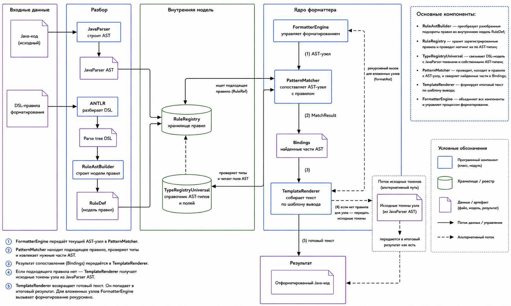

# Formatter Architecture

Formatter is built as a pipeline: the input **Java code and DSL rules are parsed** into structural models, then the formatter core **matches the JavaParser AST against rules** and **builds the final text**.



## General idea

The project separates **two** tasks:

1. **Input parsing** - Java code is converted into a JavaParser AST, and DSL rules are converted into the internal `RuleDef` model.
2. **Formatting** - AST nodes are matched against rules, matched AST parts are stored in `Bindings`, and then `TemplateRenderer` builds the text according to the output template.

This approach makes it possible to change the formatting style through rules without rewriting the main formatter core.

## Main data flow

1. The user passes a `.java` file or a directory containing such files to the formatter.
2. `JavaFormatterCli` reads the file and passes the source text to JavaParser.
3. JavaParser builds a `CompilationUnit` - the root AST node of a Java file.
4. DSL rules are parsed by the ANTLR parser.
5. `RuleAstBuilder` converts the DSL parse tree into a list of `RuleDef` objects.
6. `RuleRegistry` stores rules and returns them by name, for example `<CompilationUnit>`, `<Statement>`, `<Expression>`.
7. `FormatterEngine` starts formatting from the root rule.
8. `PatternMatcher` selects a suitable rule for the current AST node.
9. If a rule is found, the matched AST parts are stored in `Bindings`.
10. `TemplateRenderer` builds the text according to the format part of the rule.
11. For nested nodes, `FormatterEngine` is called recursively.
12. If a node has no separate rule, the renderer preserves the original tokens of this node and passes them to the result without reformatting the fragment.
13. The generated text is parsed again by JavaParser.
14. If the formatted text cannot be parsed, or if its normalized AST differs from the original AST, the file is not overwritten.
15. If the check passes successfully, the result is written to the file in `--write` mode or only shown as a potential change in `--check` mode.

## Components

| Component               | Role                                                                                                                               |
|-------------------------|------------------------------------------------------------------------------------------------------------------------------------|
| `JavaFormatterCli`      | Handles CLI arguments, collects `.java` files, runs parsing, formatting, and safe result writing.                                  |
| `JavaParser`            | Builds the AST of the source Java code.                                                                                            |
| `ANTLR`                 | Parses DSL formatting rules by generating a lexer and parser from the language description.                                         |
| `RuleAstBuilder`        | Converts the DSL parse tree into the object model of rules, `RuleDef`.                                                             |
| `RuleDef`               | Internal representation of one rule: the rule name, the pattern part, and the format part.                                         |
| `RuleRegistry`          | Rule storage. Allows the formatter to find all rules with the required name.                                                       |
| `TypeRegistryUniversal` | Maps DSL type names to JavaParser classes and reads AST node properties through getters.                                            |
| `PatternMatcher`        | Matches an AST node against the pattern part of a rule.                                                                            |
| `Bindings`              | Stores AST parts found while matching a rule.                                                                                      |
| `TemplateRenderer`      | Builds the final text according to the format part of a rule.                                                                      |
| `FormatterEngine`       | Coordinates the process: selects rules, runs the matcher, calls the renderer, and recursively formats nested nodes.                 |

## Java code parsing

The input is a source `.java` file. JavaParser builds an AST where each language construct is represented by a separate node: `CompilationUnit`, `ClassOrInterfaceDeclaration`, `MethodDeclaration`, `BlockStmt`, `IfStmt`, `ForStmt`, `ReturnStmt`, and so on.

Formatter works specifically with the Java code AST, not with a sequence of characters. Therefore, a rule can refer not directly to text tokens, but to structural fields of a JavaParser node class, for example `name`, `type`, `parameters`, `body`, `condition`, `thenStmt`, `elseStmt`, `statements`, and so on.

## DSL rule parsing

Rules have the following general form:

```ebnf
<RuleName> ::= Pattern
  => FormatExpression;
```

Example:

```ebnf
<Statement> ::= ReturnStmt(expression?=<Expression>)
  => "return" ifpresent(Expression, sp <Expression>) ";";
```

ANTLR builds a parse tree for such a rule, and `RuleAstBuilder` converts it into the internal `RuleDef` model. After that, the rule is placed into `RuleRegistry` and can be used by the formatter.

## Matching a rule against the AST

`PatternMatcher` receives the current AST node and a set of rules with the required name. It checks the rules one by one:

1. whether the AST node type matches the type in the pattern part;
2. whether the node has the required fields;
3. whether simple property values match;
4. whether nested nodes can be matched against nested rules;
5. whether lists, optional fields, and repeated elements can be matched.

If the rule fits, the matcher returns `MatchResult`, which contains `Bindings` - the matched values that will later be used by the renderer.

## Rendering the result

`TemplateRenderer` reads the format part of the rule and sequentially adds the following to the result:

- string literals: `"class"`, `"return"`, `";"`;
- spaces through `sp`;
- line breaks through `nl`;
- indentation increase through `indent`;
- indentation decrease through `dedent`;
- values from `Bindings` through placeholders like `<Expression>`;
- lists through `join(<Item>, separator)`;
- conditional fragments through `ifpresent(Name, ...)`.

For nested AST nodes, the renderer calls back into `FormatterEngine`, so formatting works recursively.

## Preserving unsupported fragments

If a specific AST node has no separate DSL rule, the formatter does not discard this fragment and does not try to guess its structure. Instead, it takes the original tokens of the node from the JavaParser AST and passes them to the final result.

This is important for practical formatting: the rule set can be expanded gradually, while already existing unsupported Java constructs are preserved unchanged.

## Safety check

Before writing the result, the formatter performs a protective check:

1. the formatted text is parsed again by JavaParser;
2. if the result cannot be parsed, the file is skipped;
3. if the result can be parsed, the normalized AST is compared with the original AST;
4. if the AST differs, the file is skipped;
5. if the AST matches, the formatter writes the result in `--write` mode.

This mechanism protects against a situation where a mistake in a rule changes the meaning of Java code or makes it invalid. Therefore, Formatter changes only the formatting and never changes the structure of the program.

## Relation to user documentation

- Quick start and CLI usage are described in [README.md](README.md).
- DSL rule writing guidelines are provided in [HowToWriteRules.md](HowToWriteRules.md).